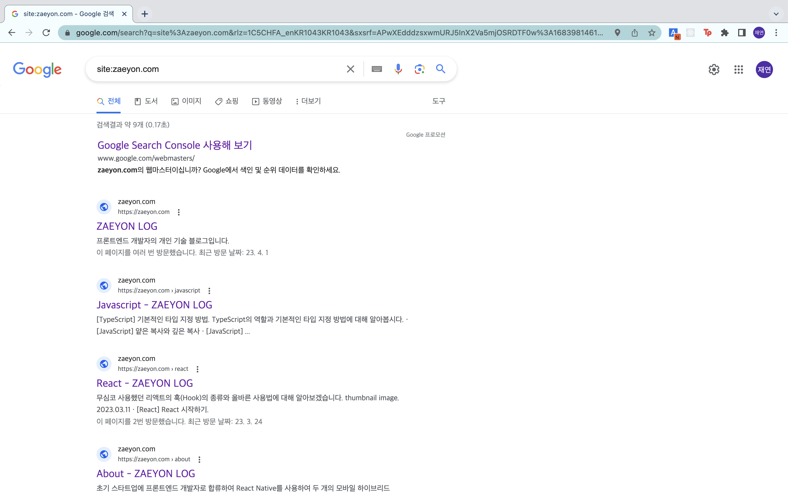

# ZAEYON LOG - 개인 블로그

## 📝 프로젝트 개요
사이트 링크: [zaeyon.com](zaeyon.com)  
마크다운 문법으로 작성된 게시글을 볼수 있는 개인 블로그 웹 서비스입니다.

## 🛠️ 기술 스택
### •  플랫폼 - Web Application
React 기반의 웹서비스로 데스크탑/모바일 반응형 디자인을 적용하였습니다.
### •  프로그래밍 언어 - JavaScript, TypeScript
JavaScript를 사용해 사용자와의 상호작용을 구현하고 이후 정적 타입지정을 위해 TypeScript로 리팩토링하였습니다.
### •  UI 라이브러리 - React.js
사용자 경험을 높이기 위해 React를 사용하여 SPA으로 개발하였습니다.
### •  SSR 프레임워크 - Next.js
기존의 React기반의 CSR 방식을 SSR 방식으로 변경하기 위해 Next.js로 리팩토링하여 SEO를 진행하였고 검색 엔진 상단에 노출되게 하였습니다.
### •  전역상태 관리 라이브러리 - Redux
전역 상태 관리를 위해 Redux를 사용하였습니다.
### •  클라우드 데이터베이스 - Firebase firestore
댓글 기능을 위해 Firestore를 사용하여 서버 구축없이 댓글 DB를 구현하였습니다.

## ⭐️ 주요 기능
### 1. 홈 화면
전체 게시글 목록을 확인 할 수 있습니다.  
메뉴를 통해 원하는 카테고리에 작성된 게시글 목록을 볼 수 있습니다.  
 

 

### 2. 게시글 상세 화면
마크다운 문법으로 작성된 게시글의 상세 내용을 확인 할 수 있습니다.  
또한 클라우트 데이터베이스 Firestore를 연동하여 댓글 기능을 구현하였습니다.
 

 

 

### 3. 검색 엔진 최적화
Next.js를 통해 서버사이드 렌더링을 적용하고   
사이트맵과 메타태그를 통해 검색 엔진 최적화 작업을 하였습니다.
 

 

### 4. 모바일 반응형 디자인
CSS에 미디어 쿼리를 통해 모바일 반응형 디자인을 적용해 모바일 디바이스에 지원되게 하였습니다.  
 

 

## 🚀 발생한 문제와 해결 방법
### 1. CRA 프로젝트의 검색 엔진 최적화(SEO)를 위한 Next.js로 마이그레이션
-> 가존의 프로젝트를 React의 CRA 방식으로 시작하면서 거의 완성되어 갈때쯤 웹사이트가 검색 엔진에 노출이 안되는 문제가 있었습니다.  
이를 해결하기 위해 기존의 CRA 방식의 프로젝트를 Next.js으로의 마이그레이션을 진행하였고 SSR 방식으로 전환하여 검색 엔진 최적화(SEO)문제를 해결하였습니다. 
### 2. Next.js와 기존의 프로젝트 라이브러리들의 호환성 문제
-> 기존의 CRA 프로젝트를 Next.js로 마이그레이션하면서 기존의 프로젝트에서 사용한 라이브러리들이 Next.js와 호환성 문제가 있었습니다.  
우선 라우팅을 위해 사용했던 React-Router가 Next.js에서 지원이 안되어 Next.js의 pages폴더안에 라우팅별로 컴포넌트를 생성하였고 Next.js의 라우팅방식으로 코드를 모두 리팩토링 하였습니다.
### 3. Next.js에서 styled-components 사용시 문제
-> 기존의 
우선 라우팅을 위해 사용했던 React-Router가 Next.js에서 지원이 안되어 Next.js의 pages폴더안에 라우팅별로 컴포넌트를 생성하였고 Next.js의 라우팅방식으로 코드를 모두 리팩토링 하였습니다.
### •  CSS-in-JS 라이브러리 - styled-components와 Next.js의 호환성 문제

