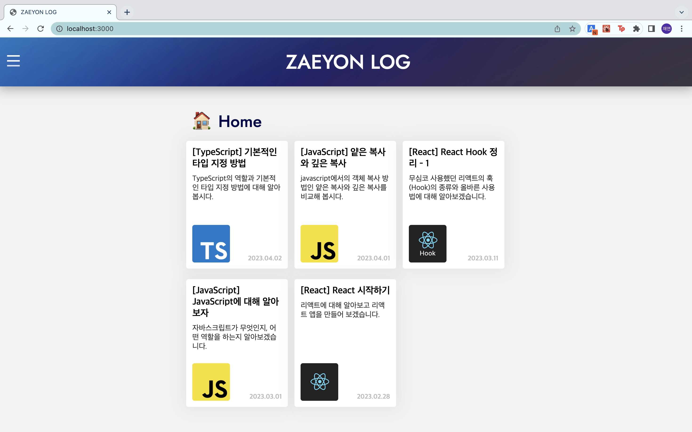
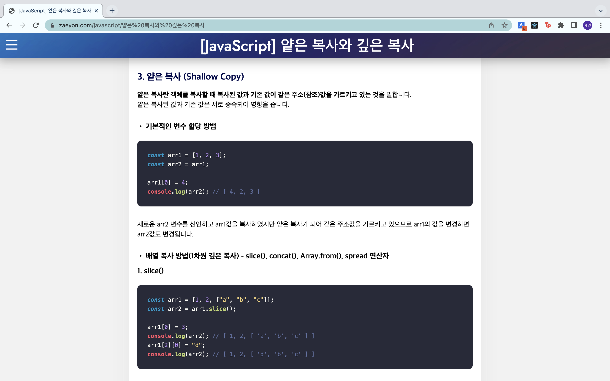
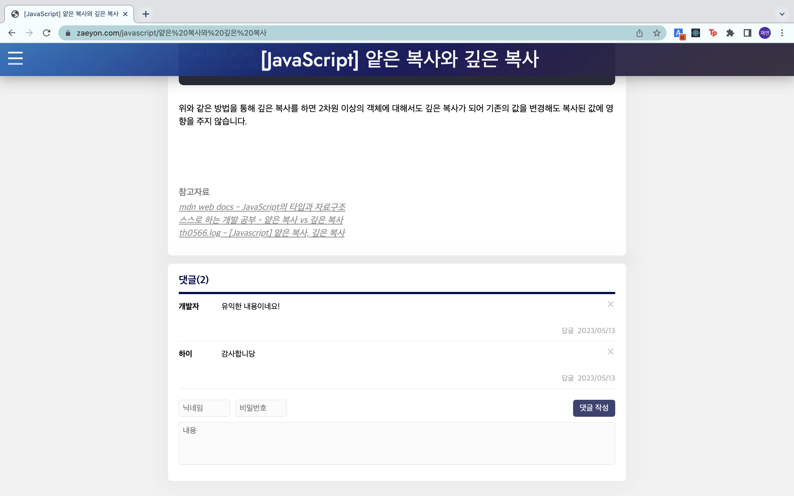

# ZAEYON LOG - 개인 블로그

## 소개
사이트 : [zaeyon.com](zaeyon.com)  
개발 관련 글을 작성할 목적으로 만든 개인 블로그입니다.

## 기술 스택
### •  프로그래밍 언어 - JavaScript, TypeScript
### •  UI 라이브러리 - React.js
### •  SSR 프레임워크 - Next.js
### •  CSS-in-JS 라이브러리 - styled-components
### •  전역상태 관리 라이브러리 - Redux
### •  클라우드 데이터베이스 - Firebase firestore

## 기능 소개
### 1. 홈 화면
전체 게시글 목록을 확인 할 수 있습니다.  
메뉴를 통해 원하는 카테고리에 작성된 게시글 목록을 볼 수 있습니다.  
 

 

### 2. 게시글 상세 화면
마크다운 문법으로 작성된 게시글의 상세 내용을 확인 할 수 있습니다.  
또한 클라우트 데이터베이스 Firestore를 연동하여 댓글 기능을 구현하였습니다.
 

 

